# SpringMVC

## 基本介绍

1. `SpringMVC`是WEB层架构，接管了Web层组件，比如控制器、视图、视图解析，返回给用户数据格式，同时支持MVC的开发模式/架构
2. `SpringMVC`通过注解，让POJO成为控制器，不需要继承类或者实现接口
3. SpringMVC采用低耦合的组件设计方式，具有更好扩展和灵活性
4. 支持 `REST` 格式的URL请求
5. SpringMVC是基于Spring的，也就是SpringMVC是在Spring基础上的。SpringMVC的核心包 `spring-webmvc-xx.jar` 和 `spring-web-xx.jar`
6. 

## 快速入门

1. 
2. 创建 `springmvc` web工程并配置 tomcat，导入SpringMVC开发需要jar包
   - 
3. 创建 `src/applicationContext-mvc.xml` 文件，即Spring的容器文件。配置**要扫描的包**，以及**视图解析器**
4. 配置 `WEB-INF/web.xml` ，配置**分发处理器**

```xml
<?xml version="1.0" encoding="UTF-8"?>
<beans xmlns="http://www.springframework.org/schema/beans"
       xmlns:xsi="http://www.w3.org/2001/XMLSchema-instance"
       xmlns:context="http://www.springframework.org/schema/context"
       xsi:schemaLocation="http://www.springframework.org/schema/beans http://www.springframework.org/schema/beans/spring-beans.xsd http://www.springframework.org/schema/context https://www.springframework.org/schema/context/spring-context.xsd">
    <!--Spring配置文件-->

    <!--配置自动扫描的包-->
    <context:component-scan base-package="com.charlie.web"/>

    <!--配置视图解析器，因为容器中只会有一个视图解析器，所以可以不用配置id，根据类型注入-->
    <bean class="org.springframework.web.servlet.view.InternalResourceViewResolver">
        <!--配置属性suffix和prefix-->
        <property name="prefix" value="/WEB-INF/pages/"/>
        <property name="suffix" value=".jsp"/>
    </bean>
</beans>
```

```xml
<?xml version="1.0" encoding="UTF-8"?>
<web-app xmlns="http://xmlns.jcp.org/xml/ns/javaee"
         xmlns:xsi="http://www.w3.org/2001/XMLSchema-instance"
         xsi:schemaLocation="http://xmlns.jcp.org/xml/ns/javaee http://xmlns.jcp.org/xml/ns/javaee/web-app_4_0.xsd"
         version="4.0">
    <!--web配置文件-->

    <!--配置前端控制器/中央控制器/分发控制器
    1. 用户的请求都会经过它的处理
    -->
    <servlet>
        <servlet-name>springDispatcherServlet</servlet-name>
        <servlet-class>org.springframework.web.servlet.DispatcherServlet</servlet-class>
        <!--配置属性 contextConfigLocation，指定 DispatcherServlet 操作的spring配置文件
        1. 如果没有配置 contextConfigLocation属性
        2. 默认按照这样的位置去定位spring配置文件：WEB-INF/springDispatcherServlet-servlet.xml
        -->
        <init-param>
            <param-name>contextConfigLocation</param-name>
            <param-value>classpath:WEB-INF/applicationContext_mvc.xml</param-value>
        </init-param>
        <!--在web项目启动时，就自动加载 DispatcherServlet 对象-->
        <load-on-startup>1</load-on-startup>
    </servlet>
    <servlet-mapping>
        <servlet-name>springDispatcherServlet</servlet-name>
        <!--说明
        1) 这里配置的url-pattern是 / ，表示用户的请求都经过 DispatcherServlet
        2) 这样配置也支持 rest 风格的url请求
        -->
        <url-pattern>/</url-pattern>
    </servlet-mapping>

</web-app>
```

```java
package com.charlie.web;

import org.springframework.stereotype.Controller;
import org.springframework.web.bind.annotation.RequestMapping;

/*
1. 当使用了SpringMVC框架，在一个类上标识 @Controller
2. 标识将该类视为一个控制器，注入到容器
3. 比原生servlet开发要简化很多
 */
@Controller
public class UserServlet {

    /* 编写方法，响应用户请求
    1. login() 方法是用于响应用户的登录请i去
    2. @RequestMapping(value = "/login") 类似于以前在原生Servlet中配置的 url-pattern，参数名value可以省略
    3. 即当用户在浏览器输入 http://localhost:8080/web工程路径/login 就能够访问到 login()
    4. return "login_ok"; 表示返回结果给视图解析器(InternalResourceViewResolver)
        ，视图解析器根据配置，来决定跳转到哪个页面
        <bean class="org.springframework.web.servlet.view.InternalResourceViewResolver">
            <property name="prefix" value="/WEB-INF/pages/"/>
            <property name="suffix" value=".jsp"/>
        </bean>
        根据上面的配置 return "login_ok";  就是转发到 /WEB-INF/pages/login_ok.jsp
     */
    @RequestMapping(value = "/login")
    public String login() {
        System.out.println("login ok...");
        return "login_ok";
    }
}
```

```html
<%@ page contentType="text/html;charset=UTF-8" language="java" %>
<html>
<head>
    <title>登录</title>
</head>
<body>
<h3>登录页面</h3>
<%--
1. javaweb web工程路径，action="login" 表示的url是 http://localhost:8080/springmvc/
2. action="/login" 表示的url是 http://localhost:8080/login
--%>
<form action="login">
    u:<input type="text" name="username"><br/>
    p:<input type="password" name="password"><br/>
    <input type="submit" value="登录">
</form>
</body>
</html>
```

## 执行流程

- 

## @RequestMapping

- `@RequestMapping`注解可以指定控制器/处理器的某个方法的请求的url

### 修饰类和方法

- `@RequestMapping`注解可以修饰房啊，也可以修饰类。当同时修饰类和方法时，请求的url就是组合
  `/类请求值/方法请求值`

```java
package com.charlie.web;

import org.springframework.stereotype.Controller;
import org.springframework.web.bind.annotation.*;

@RequestMapping(value = "/user")
@Controller
public class UserHandler {

    /*
    1. method=RequestMethod.POST：表示请求buy目标方法必须是 post
    2. RequestMethod 四个常用选项 POST, GET, PUT, DELETE
    3. SpringMVC 控制器默认支持 GET 和 POST 两种方式，即指定method时，GET和POST方法都可以
    4. buy() 方法请求的url：http://localhost:8080/工程路径/user/buy
    5. @PostMapping (value = "/buy") 等价于 把 method=RequestMethod.POST 的 @RequestMapping 方法
     */
    //@RequestMapping(value = "/buy", method = RequestMethod.POST)
    @PostMapping (value = "/buy")
    public String buy() {
        System.out.println("购买商品");
        return "success";
    }
}
```

### 指定请求方式

1. `@RequestMapping`可以指定请求的方式(`post/get/put/delete`)，请求的方式需要和指定的一样，否则报错
2. `SpringMVC`控制器默认支持 `GET` 和 `POST` 两种方式，即当不指定 `method` 时，可以接收 `GET` 和 `POST` 请求
3. 

### 指定 params 和 headers 支持简单表达式

```
 /*
 1. params = "bookId" 表示请求该目标方法时，必须给一个bookId参数，值没有限定
 2. search(String bookId)：表示请求目标方法时，携带的bookId=100，就会将请求携带的bookId对应的值100
     ，赋值给 String bookId
 3. params = "bookId=100" 表示参数bookId的值必须为100，否则会报错
  */
 @RequestMapping(value = "/find", params = "bookId=100", method = RequestMethod.GET)
 public String search(String bookId) {
     System.out.println("查询数据 bookId=" + bookId);
     return "success";
 }
```

1. `params="bookId"`：表示请求必须包含名为 `bookId` 的请求参数
2. `params!="param1"`：表示请求不能包含名为 `param1` 的请求参数
3. `params = "bookId=100"`：表示请求包含名为 `bookId` 的请求参数，且其值必须为 `100`
4. 

### 支持Ant风格资源地址

1. `?`：匹配文件名的一个字符
2. `*`：匹配文件名中的任意字符
3. `**`：匹配多层路径
4. 

```
 /*
 1. 需求：可以配置 /user/message/aa, /user/message/aa/bb/cc
 2. @RequestMapping(value = "/message/**") /** 表示可以匹配多层路径
  */
 @RequestMapping(value = "/message/**")
 public String im() {
     System.out.println("发送消息...");
     return "success";
 }
```

### 路径参数

1. `@RequestMapping`可以配合 `@PathVariable` 映射url绑定的占位符
2. 这样就可以**不需要在url地址上带参数名**了，更加简洁明了

```html
<h1>占位符的演示</h1>
<a href="user/reg/charlie/21">占位符演示</a>
```

```java
package com.charlie.web;

import org.springframework.stereotype.Controller;
import org.springframework.web.bind.annotation.*;

@RequestMapping(value = "/user")
@Controller
public class UserHandler {
   /*
   1. 要求：希望目标方法获取到 username 和 userId, value="/xx/{username}".@PathVariable("username")
   2. 前端页面：<a href="user/reg/kristina/300">占位符演示</a>
   3. value = "/reg/{username}/{userId}" 表示 charlie->{username} 21->{userId}
   4. @PathVariable("username") 需要与路径变量名 {username} 匹配，传入的参数名 String name 可以自定义
   */
   @RequestMapping(value = "/reg/{username}/{userId}")
   public String register(@PathVariable("username") String name, @PathVariable("userId") String id) {
      System.out.println("接收到参数：username=" + name + "，userId=" + id);
      return "success";
   }
}
```

### 注意事项和使用细节

1. 映射的url，不能重复
   - 
2. 各种请求的简写形式，下面的 `value=` 也可以省略
   - 
3. 当我们确定表单或者超链接会提交某个字段数据比如(email)时，要求提交的参数名和目标方法的参数名保持一致
   - 

## Postman(接口测试根据)

|  |  |  |
|---------------------------|---------------------------|---------------------------|
|  |  |  |

## REST-优雅的url请求风格

1. `Representational State Transfer`(REST)，资源表现层状态转化，是目前流行的请求方式。
2. HTTP协议里面，四个表示操作方式的动词：`GET, POST, PUT, DELETE`。分别对应四种基本操作：
   1) GET用来获取资源
   2) POST用来新建资源
   3) PUT用来更新资源
   4) DELETE用来删除资源
3. 传统的url是通过**参数**来说明crud类型，rest是通过get/post/put/delete来说明crud的类型
4. REST的核心过滤器 `HiddenHttpMethodFilter`
   - 

```xml
<!--web.xml配置-->
<!--配置HiddenHttpMethodFilter过滤器
1. 作用：把以POST方式提交的delete/put请求进行转换
2. 配置 url-pattern 为 /* 表示所有请求都经过 hiddenHttpMethodFilter过滤
-->
<filter>
    <filter-name>hiddenHttpMethodFilter</filter-name>
    <filter-class>org.springframework.web.filter.HiddenHttpMethodFilter</filter-class>
</filter>
<filter-mapping>
    <filter-name>hiddenHttpMethodFilter</filter-name>
    <url-pattern>/*</url-pattern>
</filter-mapping>

<!--springDispatcherServlet-servlet.xml-->
<!--加入两个常规配置-->
<!--支持SpringMVC的高级功能，比如JSR303校验，映射动态请求-->
<mvc:annotation-driven/>
<!--将SpringMVC不能处理的请求，交给tomcat处理，比如css,js等-->
<mvc:default-servlet-handler/>
```

```html
<%@ page contentType="text/html;charset=UTF-8" language="java" %>
<html>
<head>
    <title>rest</title>
    <script type="text/javascript" src="script/jquery-3.6.0.min.js"></script>
    <script type="text/javascript">
        $(function () { // 当页面加载完成后，就执行
            // alert("OK!");
            $("#deleteBook").click(function () {
                // alert("点击...");
                // 自定义一个提交行为，把href值，填入到hiddenForn的action
                $("#hiddenForm").attr("action", this.href);
                $(":hidden").val("DELETE");
                $("#hiddenForm").submit();
                return false;   // 点击超链接，但不提交
            })
        })
    </script>
</head>
<body>
<h3>Rest风格的crud操作案例</h3>
<br><hr>

<h3>rest风格的url-查询书籍[get]</h3>
<a href="user/book/111">点击查询书籍</a>
<br><hr>

<h3>rest风格的url-添加书籍[post]</h3>
<form action="user/book" method="post">
    name:<input name="bookName" type="text"><br>
    <input type="submit" value="添加书籍">
</form>
<br><hr>

<h3>rest 风格的url, 删除一本书</h3>
<%--分析
1. 在默认情况下，超链接发出的是GET请求
2. 怎么样将GET请求，转成 springmvc 可以识别的delete，就要考虑 HiddenHttpMethodFilter
    public static final String DEFAULT_METHOD_PARAM = "_method";
    --------------------------------------------------------------
    private static final List<String> ALLOWED_METHODS =
        Collections.unmodifiableList(Arrays.asList(HttpMethod.PUT.name(),
                HttpMethod.DELETE.name(), HttpMethod.PATCH.name()));

    if ("POST".equals(request.getMethod()) && request.getAttribute(WebUtils.ERROR_EXCEPTION_ATTRIBUTE) == null) {
        String paramValue = request.getParameter(this.methodParam);
        if (StringUtils.hasLength(paramValue)) {
            String method = paramValue.toUpperCase(Locale.ENGLISH);
            if (ALLOWED_METHODS.contains(method)) {
                requestToUse = new HttpMethodRequestWrapper(request, method);
            }
        }
    }
3. 从源码中可以看到，HiddenHttpMethodFilter过滤器可以对以POST方式提交的delete/put/patch进行转换，转换成
    springmvc可以识别的 RequestMethod.DELETE / PUT / ...
4. 需要将 get 请求 <a href="user/book/600">删除指定id的书</a> ，以post房四海提交给后端handler，这样过滤器才会生效
5. 可以通过前端 jquery 实现
--%>
<a href="user/book/600" id="deleteBook">删除指定id的书</a>
<form action="" method="post" id="hiddenForm">
    <input type="hidden" name="_method"/>
</form>
<br><hr>

<h3>rest风格的url修改书籍[put]~</h3>
<form action="user/book/123" method="post">
    <input type="hidden" name="_method" value="PUT">
    <input type="submit" value="修改书籍~">
</form>
</body>
</html>
```

```java
package com.charlie.web.rest;

import org.springframework.stereotype.Controller;
import org.springframework.web.bind.annotation.*;

@Controller
@RequestMapping("/user")
public class BookHandler {  // 处理rest风格的请求-增删改查
    // 查询[GET]
    @GetMapping("/book/{id}")
    public String getBook(@PathVariable("id") String id) {
        System.out.println("查询书籍 id=" + id);
        return "success";
    }

    // 添加[PST]
    @PostMapping("/book")
    public String addBook(String bookName) {
        System.out.println("bookName=" + bookName);
        return "success";
    }

    // 删除[DELETE]
    @RequestMapping(value = "/book/{id}", method = RequestMethod.DELETE)
    public String delBook(@PathVariable("id") String id) {
        System.out.println("删除书籍 id=" + id);
        //return "success";   // 如果这样返回会报错：HTTP Status 405 - JSPs only permit GET POST or HEAD
        /* "redirect:/user/success" 重定向
        1. 第一个/在后端执行，会被解析成 /springmvc/user/success
         */
        return "redirect:/user/success";
    }

    // 如果请求是 /user/success，就转发到 success.jsp
    @RequestMapping("/success")
    public String successGeneral() {
        return "success";   // 由该方法转发到 success.jsp 页面
    }

    // 修改[PUT]
    @PutMapping("/book/{id}")
    public String updateBook(@PathVariable("id") String id) {
        System.out.println("修改书籍 id=" + id);
        return "redirect:/user/success";
    }
}
```

### 注意事项和细节说明

1. `HiddenHttpMethodFilter`在将post转成delete/put请求时，是按 `_method` 参数名来读取的
2. 

## SpringMVC映射请求数据

### 获取参数值

- 开发中，如何获取到 `http://xxx/url?参数名=参数值&参数名=参数值`

```java
package com.charlie.web.requestparam;

@Controller
@RequestMapping("/vote")
public class VoteHandler {
    /* @RequestParam(value = "name", required = false)
    1. 获取到超链接传递的数据，请求 http://localhost:8080/springmvc/vote/vote01?name=charlie
    2. @RequestParam 表示会接收提交的参数
    3. value 表示提交的参数名是 name
    4. required=false 表示该参数可以没有；默认true，表示必须传递该参数
    5. 当使用了 @RequestParam(value = "name", required = false) 就将参数name指定给传入形参
     */
    @RequestMapping("/vote01")
    public String test01(@RequestParam(value = "name", required = false) String username) {
        System.out.println("得到的username=" + username);
        return "success";
    }
}
```

### 获取http请求消息头

```java
@Controller
@RequestMapping("/vote")
public class VoteHandler {
    /*
    需求：获取http请求头消息，获取到 Accept-Encoding 和 Host
    1. 这个涉及到前面讲过的http协议
    2. @RequestHeader("Http请求头字段")
     */
    @RequestMapping("/vote02")
    public String test02(@RequestHeader("Accept-Encoding") String ae, @RequestHeader("Host") String host) {
        System.out.println("Accept-Encoding=" + ae);
        System.out.println("Host=" + host);
        return "success";
    }
}
```

### 获取javabean形式的数据

1. 支持级联数据获取
2. 表单的控件名称name需要和javabean对象字段对应，否则就是null

```html
<%--
1. 这是一个表单，表单的数据对应Master对象
2. 提交的数据参数名和对象的字段名一致即可
--%>
<h2>封装javabean</h2>
<form action="vote/vote03" method="post">
    主人号：<input type="text" name="id"><br/>
    主人名：<input type="text" name="name"><br/>
    宠物号：<input type="text" name="pet.id"><br/>
    宠物名：<input type="text" name="pet.name"><br/>
    <input type="submit" value="添加主人和宠物">
</form>
```

```
 /*
 演示如何获取到提交的数据->封装成java对象
 1. 方法的形参用对应的类型来指定即可，SpringMVC会自动地进行封装
 2. 如果要自动地完成封装，要求提交地数据参数名和对象地字段名保持一致
 3. 如果属性是对象，这里仍然是通过 字段名.字段名 来赋值，比如 Master[pet]，
     提交地数据参数名是 pet.id, pet.name
 4. 如果提交地数据的参数名和对象的字段名不匹配，则对象的属性值就是 null
 5. 底层是 反射+注解
  */
 @RequestMapping("/vote03")
 public String test03(Master master) {
     System.out.println("master=" + master);
     return "success";
 }
```

### 获取servlet api

1. 开发中，可能需要使用到原生的 `servlet api`
2. 需要引入 `tomcat/lib` 下的 `servlet-api.jar`
3. 

```java
@Controller
@RequestMapping("/vote")
public class VoteHandler {
   // 获取servlet api，来获取提交的数据
   @RequestMapping("/vote04")
   public String test04(HttpServletRequest req, HttpServletResponse resp,
                        HttpSession hs) {

      // 获取到session
      HttpSession session = req.getSession();
      System.out.println("session=" + session);
      // 注意：通过参数传入的hs和req.getSession()得到的session对象是同一个对象
      System.out.println("hs=" + hs);

      String username = req.getParameter("username");
      String password = req.getParameter("password");
      System.out.println("username=" + username + "\npassword=" + password);
      return "success";
   }
}
```

## 模型数据

### 数据放入request域

> 开发中，控制器/处理器中获取的数据如何放入 `request` 域，然后再前端(VUE/JSP/...)取出显示

```html
<h1>添加主人信息[测试数据放入request域]</h1>
<form action="vote/vote0?" method="post">
    主人号：<input type="text" name="id"><br/>
    主人名：<input type="text" name="name"><br/>
    宠物号：<input type="text" name="pet.id"><br/>
    宠物名：<input type="text" name="pet.name"><br/>
    <input type="submit" value="添加主人和宠物">
</form>
```

```html
<%@ page contentType="text/html;charset=UTF-8" language="java" %>
<html>
<head>
    <title>vote_ok</title>
</head>
<body>
<h1>获取的数据显示页面</h1>
<hr/>取出 request域的数据-通过前面el表达式获取<br/>
address: ${requestScope.address}<br>
主人名字：${requestScope.master.name}<br/>
主人信息：${requestScope.master.id}<br/>
主人名字：${requestScope.master.pet.name}<br/>
</body>
</html>
```

#### 1.通过HttpServletRequest

```java
public class VoteHandler {
   /* 演示将提交的数据封装到java对象，springmvc会自动将其放入到request域
   1. springmvc会自动将获取的model模型，放入到request域
   2. 也可以手动将master放入到request域，即 ("master", master)
   3. 这样就可以在跳转到的页面(vote_ok.jsp)，取出数据
   */
   @RequestMapping("/vote05")
   public String test05(Master master, HttpServletRequest req) {
      // 1) 手动添加request域数据
      req.setAttribute("address", "TianJin");
      // 2) 也可以修改master的属性值，根据引用机制，域中的数据也会改变
      master.setName("Charlie");
      // 3) springmvc默认存放对象到request域中，属性名是通过 request域 ("master", master)
      //      属性名：类型名首字母小写
      return "vote_ok";
   }
}
```

#### 2.通过请求方法参数 Map<String, Object>

```java
public class VoteHandler {
   // 演示通过Map<String, Object> 设置数据到request域
   @RequestMapping("/vote06")
   public String test06(Master master, Map<String, Object> map) {
      // 1. 需求：通过map对象，添加属性到request域
      // 2. 原理分析：springmvc会遍历map，将map的k-v存放到request域
      map.put("address", "HK");
      //map.put("master", null);  // 将request中k为master的值置为null
      return "vote_ok";
   }
}
```

#### 3.通过返回ModelAndView对象

```java
public class VoteHandler {
   // 演示通过返回ModelAndView对象，将数据放入到request域
   @RequestMapping("/vote07")
   public ModelAndView test07(Master master) {
      ModelAndView modelAndView = new ModelAndView();
      // 放入属性到modelAndView对象，最终也会放入到request域中
      modelAndView.addObject("address", "CN");
      // 可以把从数据库中得到的数据对象，放入到modelAndView[service-dao-db]
      // 这里指定跳转的视图名称
      modelAndView.setViewName("vote_ok");
      return modelAndView;
   }
}
```

#### 4.注意事项

1. 从本质看，请求响应的方法 `return "xx";` 是返回了一个字符串，其实本质是返回了一个 `ModelAndView` 对象，
   只是默认被封装起来的。
2. ModelAndView既可以包含model数据，也可以包含视图信息
3. ModelAndView对象的 `addObject` 方法可以添加 `key-val` 数据，默认在request域中
4. ModelAndView对象的 `setViewName` 方法可以指定视图名称

### 数据放入session

```java
@RequestMapping("/vote")
public class VoteHandler {
   // 演示如何将数据设置到session中
   @RequestMapping("/vote08")
   public String test08(Master master, HttpSession httpSession) {
      // master对象是默认放在request域中，以下将对象放入到session中
      httpSession.setAttribute("master", master);
      httpSession.setAttribute("address", "JP");
      return "vote_ok";
   }
}
```

### @ModelAttribute实现prepare方法

1. 开发中，有时需要使用某个前置方法(比如`prepareXX()`)，给目标方法准备一个模型对象
2. `@ModelAttribute`注解可以实现这样的需求
3. 在某个方法上，增加了该注解后，在调用该Handler的任何一个方法时，都会先调用这个方法
4. 

```java
@RequestMapping("/vote")
public class VoteHandler {
   /*
   1. 当Handler的方法被表示 @ModelAttribute
   2. 当调用该Handler的其它方法时，都会先执行该前置方法
   3. 类似于Spring的AOP的前置通知
   4. prepareModel配置方法，会切入到其它方法前执行...
    */
   @ModelAttribute
   public void prepareModel() {
      System.out.println("prepareModel()-------完成准备工作----------");
   }
}
```

## 视图和视图解析器

### 基本介绍

1. 在 `SpringMVC` 中的目标方法中最终返回的都是一个**视图**(有各种视图)
2. 返回的视图都会由一个**视图解析器**来处理(视图解析器有很多种)
3. 在默认情况下，都是返回默认的视图，然后这个返回的视图交由SpringMVC的 `InterbalResourceViewResolver`视图处理器来处理的
   - 
4. 在实际开发中，有时需要自定义视图，这样可以满足更多更复杂的需求

```xml
 <!--
 1. 配置自定义视图解析器 BeanNameViewResolver
 2. 可以去解析我们自定义的视图
 3. 配置属性 order 表示视图解析器执行的顺序，值越小优先级又高
 4. 属性order的默认优先级是最低的，值为 Integer.MAX_VALUE
 -->
 <bean class="org.springframework.web.servlet.view.BeanNameViewResolver">
     <property name="order" value="99"/>
 </bean>
```

```java
package com.charlie.web.viewresolver;

import org.springframework.stereotype.Component;
import org.springframework.web.servlet.view.AbstractView;

import javax.servlet.http.HttpServletRequest;
import javax.servlet.http.HttpServletResponse;
import java.util.Map;

/* 自定义视图
1. MyView 继承了 AbstractView，就可以作为一个视图使用
2. Component(value = "myView") 将视图注入到容器中，名字/id是 myView
 */
@Component(value = "myView")
public class MyView extends AbstractView {
    @Override
    protected void renderMergedOutputModel(Map<String, Object> model, HttpServletRequest request, HttpServletResponse response) throws Exception {
        // 完成视图渲染，并且可以确定要跳转的页面 /WEB-INF/page/my_view.jsp
        System.out.println("进入到自己的视图...");
        /*
        1. 下面就是进行请求转发到 /WEB-INF/pages/my_view.jsp，访问WEB-INF目录下资源需要使用请求转发
        2. /WEB-INF/pages/my_view.jsp 会被springmvc(服务器端)解析成 /springmvc/WEB-INF/pages/my_view.jsp
         */
        request.getRequestDispatcher("/WEB-INF/pages/my_view.jsp").forward(request, response);
    }
}
```

### 自定义视图工作流程小结

1. 自定义视图：创建一个 `View` 的bean，该bean需要继承自 `AbstractView`，并实现 `renderMergedOutputModel`方法
2. 并把自定义View加入到IOC容器中
3. 自定义视图处理器，使用 `BeanNameViewResolver`，这个视图处理器也需要配置到IOC容器
4. `BeanNameViewResolver`的调用优先级需要设置一下，设置 `order` 比 `Integer.MAX_VALUE`小的值，以确保其在 `InternalResourceViewResolver`
   之前被调用
5. 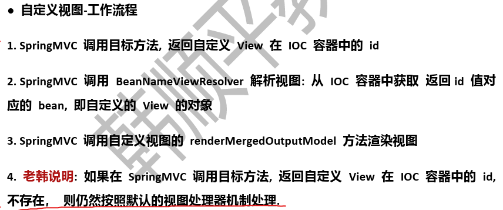
6. 默认视图解析器一旦进行解析，即使没有找到相应资源，也不会再执行其它自定义解析器(优先级更低的)

### 指定请求转发或者重定向

1. 默认返回的方式是请求转发，然后用视图处理器进行处理，比如在目标方法中这样写 `return "ok";`
2. 也可以在目标方法直接指定重定向活转发的url地址
3. 如果指定重定向，则不能定向到 `/WEB-INF/` 目录中

```java
package com.charlie.web.viewresolver;

import org.springframework.stereotype.Controller;
import org.springframework.web.bind.annotation.RequestMapping;

@Controller
@RequestMapping("/goods")
public class GoodsHandler {
    // 演示直接指定要请求转发的或者是重定向的页面
    @RequestMapping("/order")
    public String order() {
        System.out.println("==========order()=========");
        // 请求转发到 /WEB-INF/pages/my_view.jsp，会被解析到 /springmvc/WEB-INF/pages/my_view.jsp
        //return "forward:/WEB-INF/pages/my_view.jsp";

        /* 直接指定要重定向的页面
        1. 对于重定向来说，不能重定向到 /WEB/-INF/ 目录下
        2. redirect 关键字，表示进行重定向
        3. /login.jsp 会在服务器解析为 /springmvc/login.jsp
         */
        return "redirect:/login.jsp";
    }
}
```

## 自己实现SpringMVC底层机制

略

## 数据格式化

### 基本介绍

> 说明：在提交数据(比如表单时)SpringMVC怎样对提交的数据进行转换和处理

1. 基本数据类型可以和字符串之间自动完成转换，比如：SpringMVC上下文中内奸了很多转换器，可完成大多数java类型的转换工作
2. 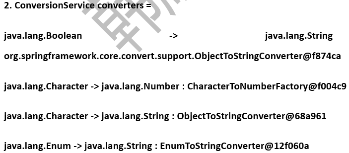

### 特殊数据类型和字符串

1. 特殊数据类型和字符串之间的转换使用**注解**(比如日期，规定格式的小数比如货币形式等)
2. 对于日期和货币可以使用 `@DateTimeFormat` 和 `@NumberFormat` 注解，把这两个注解标记在字段上即可

```java
public class Monster {
    private Integer id;
    private String email;
    
    @DateTimeFormat(pattern = "yyyy-MM-dd")
    private Date birthday;

    @NumberFormat(pattern = "###,###.##")
    private Float salary;
}
```

## 验证以及国际化

1. 对输入的数据(比如表单数据)，进行必要的验证，并给出相应的提示信息
2. 对于验证表单数据，springmvc提供了很多使用的注解，这些注解由JSR303验证框架提供
3. JSR303验证框架
   - 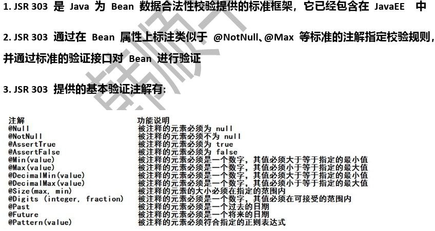
4. `Hibernate Validator`扩展注解
   - 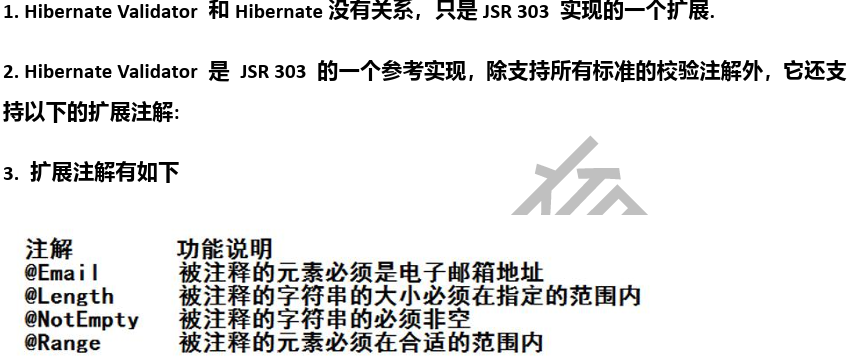
5. 给Monster的字段加上数据验证的注解
   - 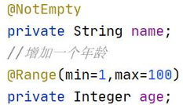
   - 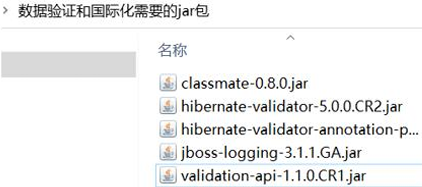

```java
package com.charlie.web.datavalid;

import com.charlie.web.datavalid.entity.Monster;
import org.springframework.context.annotation.Scope;
import org.springframework.stereotype.Controller;
import org.springframework.validation.Errors;
import org.springframework.validation.ObjectError;
import org.springframework.web.bind.annotation.RequestMapping;

import javax.validation.Valid;
import java.util.List;
import java.util.Map;


/**
 * MonsterHandler处理器响应用户提交数据
 * @Scope(value = "prototype") 表示每次请求MonsterHandler会生成一个新的对象
 */
@Controller
@Scope(value = "prototype")
public class MonsterHandler {
    /**
     * 显示添加monster的界面
     * 1. 这里的Map<String, Object> map，当向map中添加数据时会默认存放在request域中
     */
    @RequestMapping(value = "/addMonsterUI")
    public String addMonsterUI(Map<String, Object> map) {
        map.put("monster", new Monster());
        // 如果跳转的页面使用了SpringMVC标签，那么就需要准备一个对象，放入request域中，这个对象的属性名monster
        //      对应表单标签的 modelAttribute="monster"
        return "datavalid/monster_addUI";
    }

    /* 编写方法，处理添加妖怪
    1. SpringMVC可以将提交的数据，按照参数名和对象的属性名匹配
    2. 直接封装到对象中
    3. @Valid Monster monster 表示对monster接收的数据进行校验
    4. Errors errors 表示如果校验出现错误，将校验错误信息保存到errors
    5. Map<String, Object> map 表示如果校验出现错误，将校验的错误信息保存到map，提示保存monster对象
    6. 校验发生的时机：在springmvc底层，反射调用目标方法时，会接收http请求的数据，然后根据注解来进行验证，
        在验证过程中，如果出现了错误，就把错误信息填充errors和map。底层：反射+注解
     */
    @RequestMapping(value = "/save")
    public String save(@Valid Monster monster, Errors errors, Map<String, Object> map) {
        System.out.println("------monster------" + monster);
        // 为了看到校验的效果，输出map和errors
        System.out.println("======== map ========");
        for (Map.Entry<String, Object> entry : map.entrySet()) {
            System.out.println("key=" + entry.getKey() + ", value=" + entry.getValue());
        }
        System.out.println("======== errors ========");
        if (errors.hasErrors()) {
            List<ObjectError> allErrors = errors.getAllErrors();
            for (ObjectError error : allErrors) {
                System.out.println("error=" + error);
            }
            return "datavalid/monster_addUI";
        }
        return "datavalid/success";
    }
}
```

- 配置国际化文件

```xml
 <!--配置国际化错误信息资源处理bean-->
 <bean id="messageSource" class="org.springframework.context.support.ResourceBundleMessageSource">
     <!--配置国家化文件名字，如果这样配置的话，表示messageSource回到 src/i18nXXX.properties去读取错误信息-->
     <property name="basename" value="i18n"></property>
 </bean>
```

```html
<%@ taglib prefix="form" uri="http://www.springframework.org/tags/form" %>
<%@ page contentType="text/html;charset=UTF-8" language="java" %>
<html>
<head>
    <title>添加妖怪</title>
</head>
<body>
<h3>添加妖怪</h3>
<%--这里的表单使用的是SoringMVC的标签来完成的
1. SpringMVC表单标签在显示之前必须在 request中有一个bean，该bean的属性和表单标签的字段要对应
    request域中的key为：form标签的modelAttribute属性值，比如这里的monster
2. SpringMVC的 form:from标签的action属性值中的 / 不代表 WEB应用的根目录
3. 这里使用SpringMVC的标签主要目的是为了方便提示信息回显
--%>
<form:form action="save" method="post" modelAttribute="monster">
    妖怪名字：<form:input path="name"/><form:errors path="name"/> <br/>
    妖怪年龄：<form:input path="age"/><form:errors path="age"/> <br/>
    电子邮件：<form:input path="email"/><form:errors path="email"/> <br/>
    妖怪生日：<form:input path="birthday"/><form:errors path="birthday"/> 要求以"9999-11-11"的形式<br/>
    妖怪薪水：<form:input path="salary"/><form:errors path="salary"/> 要求以"123,890.12"的形式<br/>
    <input type="submit" value="添加妖怪"/>
</form:form>
</body>
</html>
```

### 细节说明和注意事项

1. 在需要验证的 `JavaBean/POJO`的字段上加上相应的验证注解
2. 目标方法上，在 `JavaBean/POJO`类型的参数前，添加 `@Valid`注解，告知SpringMVC是需要验证的
3. 在 `@Valid` 注解之后，添加一个 `Error` 或 `BindingResult`类型的参数，可以获取到验证的错误信息
4. 需要使用 `<form:errors path="email"></form:errors>`标签来显示错误信息，这个标签需要写在`<form:form>`标签内生效
5. 错误信息的国际化文件 `i18n.properties`，中文需要是`Unicode`编码，使用工具转码
6. 格式：验证规则.表单(modelAttribute值).属性名=消息信息
   - 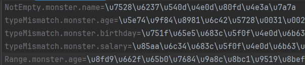
7. 注解 `@NotNull`和 `NotEmpty`的区别说明
   - 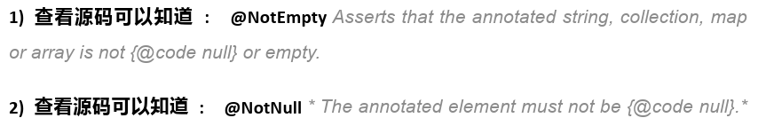
8. SpringMVC验证时，会根据不同的验证错误，返回对应的信息

### 注解的结合使用

- 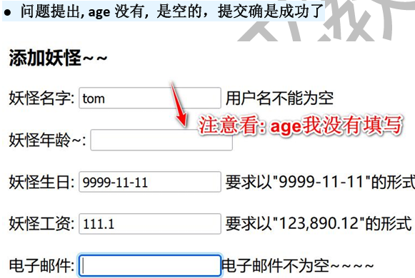
- 解决方法：将`@NotNull` + `@Range`组合使用

```java
package com.charlie.web.datavalid.entity;

import org.hibernate.validator.constraints.NotEmpty;
import org.hibernate.validator.constraints.Range;
import org.springframework.format.annotation.DateTimeFormat;
import org.springframework.format.annotation.NumberFormat;

import javax.validation.constraints.NotNull;
import java.util.Date;

public class Monster {
    private Integer id;

    @NotEmpty(message = "邮箱不能为空")
    private String email;

    @NotNull(message = "年龄不能为空")
    // @Range(min = 1, max = 100) 表示接收的age值在1~100之间
    @Range(min = 1, max = 100)
    private Integer age;

    // @NotEmpty 表示name不能为空
    // Asserts that the annotated string, collection, map or array is not {@code null} or empty.
    //@NotEmpty
    private String name;

    @NotNull(message = "生日不能为空")
    @DateTimeFormat(pattern = "yyyy-MM-dd")
    private Date birthday;

    @NotNull(message = "薪水不能为空")
    @NumberFormat(pattern = "###,###.##")
    private Float salary;

    public Monster() {}
}
```

### 数据类型转换校验核心类-DataBinder

- DataBinder工作机制
  - 通过反射机制对目标方法进行解析，将请求消息绑定到处理方法的入参中，数据绑定的核心部件是DataBinder，运行机制如下
  - 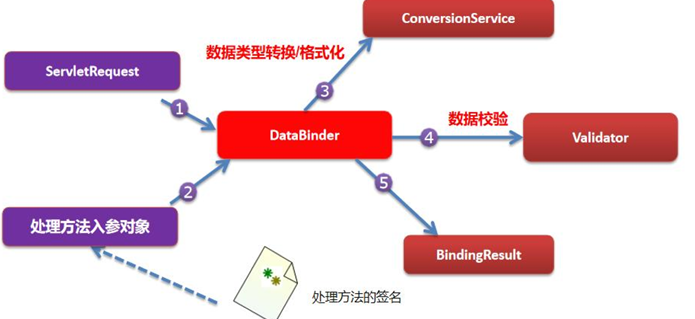
- Debug一下`validate`得到验证`errors`信息
  - 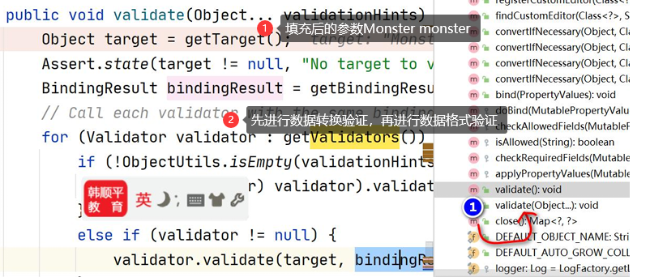

### 取消某个属性的绑定

> 在默认情况下，表单提交的数据都会和POJO类型的JavaBean属性绑定，如果在开发中希望取消某个属性的绑定，即
> **不希望接收到某个表单对应的属性的值**，则可以通过 `@InitBinder`注解取消绑定

1. 编写一个方法，使用@InitBinder标识的该方法，可以对WebDataBinder对象进行初始化。WebDataBinder是DataBinder 的子类，用于完成由表单字段到JavaBean属性的绑定
2. `@InitBinder`方法不能有返回值，它必须声明为void
3. `@InitBinder`方法的参数通常是`WebDataBinder`

```java
@Controller
@Scope(value = "prototype")
public class MonsterHandler {
    // 取消绑定monster的name表单提交的值给monster.name属性
    @InitBinder
    public void initBinder(WebDataBinder webDataBinder) {
        /*
        1. 方法上需要标注 @InitBinder，SpringMVC底层会初始化WebDataBinder
        2. 调用 webDataBinder.setDisallowedFields("name"); 表示取消指定属性的绑定，即
            当表单提交的字段为name时，就不再把接收到的name值填充到monster的name属性
        3. 机制：SpringMVC在底层通过反射调用方法时，会接收到http请求的参数和值，使用反射+注解技术，取消对指定属性的填充
        4. setDisallowedFields支持可变参数，可以填写多个字段，如 setDisallowedFields("name", "email");
        5. 如果取消某个属性绑定，验证也就没有意义了，应当把验证的注解去掉，否则可能会报错；name属性会使用默认值，即null
            // @NotEmpty
            private String name;
         */
        webDataBinder.setDisallowedFields("name");
    }
}
```

1. setDisallowedFields()是可变形参，可以指定多个字段
2. 当将一个字段/属性，设置为disallowed,就不在接收表单提交的值，那么这个字段/属性的值，就是该对象默认的值(具体看程序员定义时指定)
3.  一般来说，如果不接收表单字段提交数据，则该对象字段的验证也就没有意义了可以注销掉，比如注销`//@NotEmpty`
